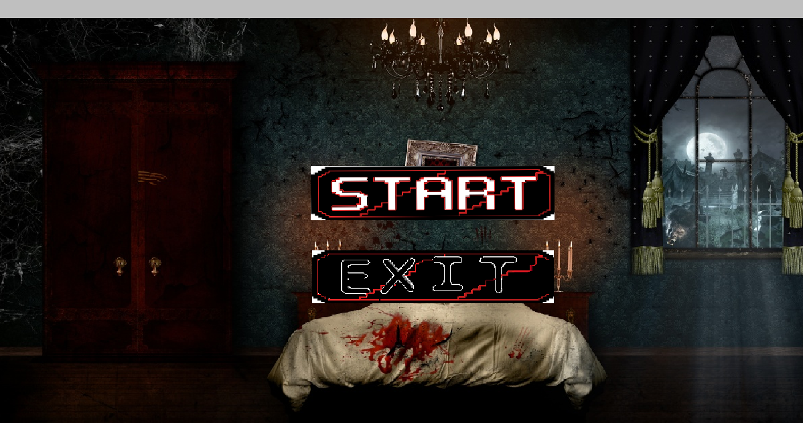
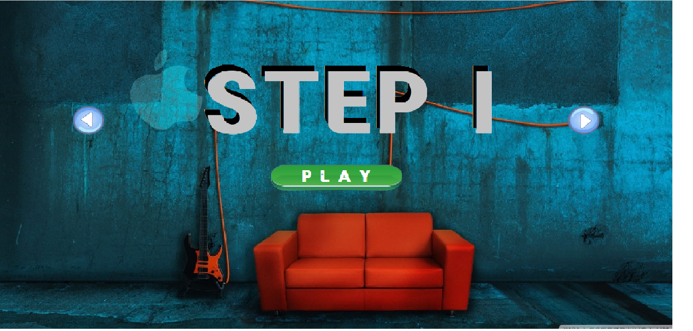
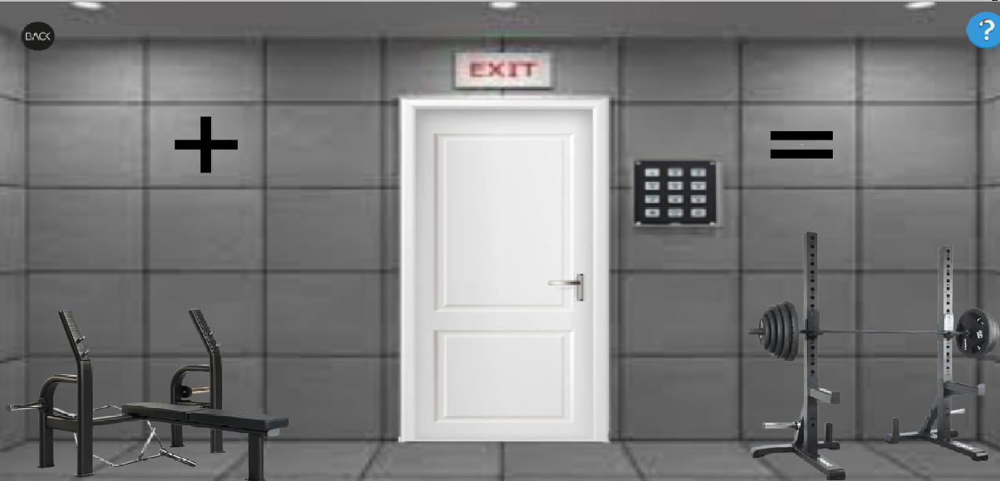
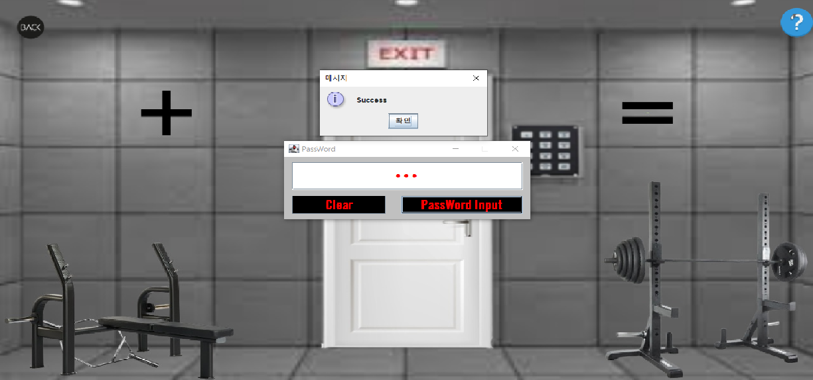

<div id="top"></div>
<!--
*** Thanks for checking out the Best-README-Template. If you have a suggestion
*** that would make this better, please fork the repo and create a pull request
*** or simply open an issue with the tag "enhancement".
*** Don't forget to give the project a star!
*** Thanks again! Now go create something AMAZING! :D
-->

<!-- PROJECT SHIELDS -->
<!--
*** I'm using markdown "reference style" links for readability.
*** Reference links are enclosed in brackets [ ] instead of parentheses ( ).
*** See the bottom of this document for the declaration of the reference variables
*** for contributors-url, forks-url, etc. This is an optional, concise syntax you may use.
*** https://www.markdownguide.org/basic-syntax/#reference-style-links
-->


<!-- PROJECT LOGO -->
<br />
<div align="center">
  <a href="https://github.com/kimdonghyeon3/escaperoom">
    
  </a>

<h3 align="center">Escape Room Game</h3>

  <p align="center">
    Java Gui를 활용한 방탈출 게임
    <br />
    <a href="https://github.com/kimdonghyeon3/escaperoom"><strong>View Demo »</strong></a>
    <br />
    <br />

  </p>
</div>

<hr/>

<!-- ABOUT THE PROJECT -->
## About The Project



Java에서 재공하는 swing과 image을 활용하여, 방을 탈출하는 게임 입니다.
해당 게임은 총 2개의 Step으로 이루어져 있으며, 각 Step마다 색다른 태마와 노래를 즐기며, 방탈출을 할 수 있습니다! 간단한 게임인 만큼 주변 사물을 잘 관찰하면, 쉽게 방을 탈출할 수 있습니다. 문 옆의 비밀번호를 클릭하시면, 비밀번호를 입력할 수 있습니다.

<p align="right">(<a href="#top">back to top</a>)</p>

### Built With


<p align="right">(<a href="#top">back to top</a>)</p>

<!-- GETTING STARTED -->
## Getting Started

 본 프로젝트는 배포 없이 Local에서 작동합니다.


### 설치 방법

1. JavaZoom.jar DownLoad
<br>
https://jar-download.com/artifacts/javazoom

2. Clone the repo
   ```sh
   git clone https://github.com/kimdonghyeon3/escaperoom.git
   ```
3. Install NPM packages
   ```sh
   npm install
   ```
4. JavaZoom.jar Build PATH 추가
5. Run

<p align="right">(<a href="#top">back to top</a>)</p>


<!-- USAGE EXAMPLES -->
## Usage

게임이 들어가지면, START를 통해 STEP을 정할 수 있습니다.

알맞은 STEP을 고라 PLAY을 누르시면 즐기실 수 있습니다.

<p align="right">(<a href="#top">back to top</a>)</p>

<!-- DEMO EXAMPLES -->
## Demo




<p align="right">(<a href="#top">back to top</a>)</p>

<!-- CONTACT -->
## Contact

Email - kimdonghyeon98@gmail.com

Project Link: [https://github.com/kimdonghyeon3/escaperoom](https://github.com/kimdonghyeon3/escaperoom)

<p align="right">(<a href="#top">back to top</a>)</p>


MIT License
Copyright (c) 2021 Othneil Drew

<!-- MARKDOWN LINKS & IMAGES -->
<!-- https://www.markdownguide.org/basic-syntax/#reference-style-links -->
[contributors-shield]: https://img.shields.io/github/contributors/github_username/repo_name.svg?style=for-the-badge
[contributors-url]: https://github.com/github_username/repo_name/graphs/contributors
[forks-shield]: https://img.shields.io/github/forks/github_username/repo_name.svg?style=for-the-badge
[forks-url]: https://github.com/github_username/repo_name/network/members
[stars-shield]: https://img.shields.io/github/stars/github_username/repo_name.svg?style=for-the-badge
[stars-url]: https://github.com/github_username/repo_name/stargazers
[issues-shield]: https://img.shields.io/github/issues/github_username/repo_name.svg?style=for-the-badge
[issues-url]: https://github.com/github_username/repo_name/issues
[license-shield]: https://img.shields.io/github/license/github_username/repo_name.svg?style=for-the-badge
[license-url]: https://github.com/github_username/repo_name/blob/master/LICENSE.txt
[linkedin-shield]: https://img.shields.io/badge/-LinkedIn-black.svg?style=for-the-badge&logo=linkedin&colorB=555
[linkedin-url]: https://linkedin.com/in/linkedin_username
[product-screenshot]: images/screenshot.png
